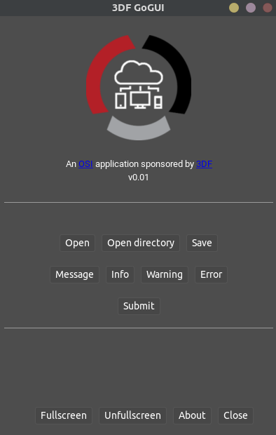

# GoGUI v0.01
**maintained by:** hkdb \<<hkdb@3df.io>\><br />

<b>THIS IS STILL WORK IN PROGRESS</b>

## Description:
---
A Webview GoLang GUI template to build small desktop utilities to automate CLI operations



Based on https://github.com/zserge/webview

Uses:
- https://github.com/jteeuwen/go-bindata
- https://github.com/skratchdot/open-golang

## Changes:

v0.01 - Initial Release - https://github.com/hkdb/GoGUI/tree/v0.01

## Before Building:

1. Install GoLang
2. Install the following libraries:
   ```
   go get -u github.com/zserge/webview/...
   go get -u github.com/jteeuwen/go-bindata/...
   go get -u github.com/skratchdot/open-golang/...
   ```

## Build & Launch:

`Linux:`

```
$ go build
$ ./GoGUI  # or whatever you renamed the app to...
```

`Mac:`

```
# Replace all the "GoGUI"s below with whatever you name the app...
$ mkdir -p GoGUI.app/Contents/MacOS
$ go build -o GoGUI.app/Contents/MacOS/GoGUI
$ open GoGUI.app # Or click on the app in Finder
```

`Windows:`

```
# Windows requires special linker flags for GUI apps.
# It's also recommended to use TDM-GCC-64 compiler for CGo.
# http://tdm-gcc.tdragon.net/download
#
# Replace all the "GoGUI"s below with whatever you name the app...
$ go build -ldflags="-H windowsgui" -o GoGUI.exe
```